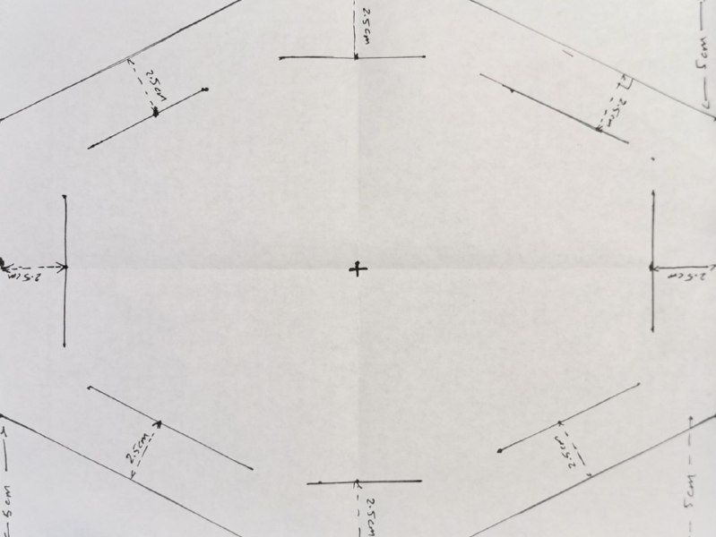
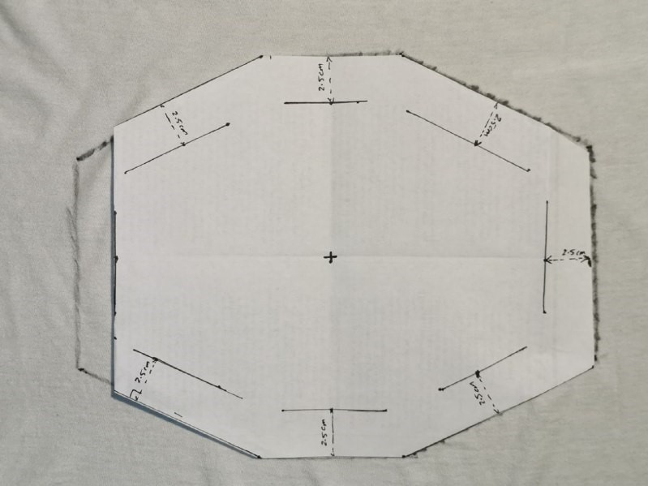

# Type 1: DIY Fine Particulate Mask v0.5 (Current)

**Disclaimer**

This is a ‘Do It Yourself’ open source mask and we are not liable or responsible in regards to its performance or characteristics or how it is used. Build and use this at your own risks. 

**NOTE: This is not a respirator.**
 
**WARNING: Masks can be dangerous to people with respiratory or heart problems.**

# Table of Contents
- [Objective](#Objective)
- [Background](#Background)
  * [Filtration Mechanisms](#Filtration-Mechanisms)
    + [Inertial Impaction](#Inertial-Impaction)
    + [Diffusion](#Diffusion)
    + [Electrostatic Attraction](#Electrostatic-Attraction)
  * [Efficacy of Homemade Masks](#Efficacy-of-Homemade-Masks)
- [Design Requirements](#Design-Requirements)
- [Material Research](#Material-Research)
  * [Filter Characterization](#Filter-Characterization)
    + [Filter Efficiency](#Filter-Efficiency)
    + [Filter Breathability](#Filter-Breathability)
    + [Filter Performance](#Filter-Performance)
- [Design](#Design)
  * [Inner Layer](#Inner-Layer)
  * [Outer Layer](#Outer-Layer)
  * [Integration](#Integration)
- [Fabrication Instructions](#Fabrication-Instructions)
* [Overview](#Overview)
* [Preparation](#Preparation)
    + [Size Selection](#Size-Selection)
    + [Materials](#Materials)
    + [Tools](#Tools)
    + [Fitting Mechanism](#Fitting-Mechanism)
<!-- toc -->

# Objective

The objective here is to use available peer reviewed publication to design a mask that can be built at home with readily available materials and tools. 

There is evidence that homemade masks may help with reducing the likelihood of infection but not eliminate the risk.1 The goal here is not to eliminate the chance of inhaling fine particulates, droplets and aerosol but provide an extra layer of protection to:

1. Provide an extra barrier on the user’s face to reduce the chance of them touching their face
2. Reduce propagation of particulates from cough and sneeze
3. Through filtration, reduce the chance of inhaling some of the particles.
4. To provide the best possible homemade solution as a last resort where alternatives are not accessible or reserved for frontline workers.

# Background

The filtering systems used by respirators and masks have the ability to filter diverse particle sizes while maintaining breathability. Respirator filter design is always a tradeoff between breathability and filtration performance. 

## Filtration Mechanisms

There are three mechanisms involved in the filtration process of respirators and masks. These are inertial impaction, diffusion, and electrostatic attraction2:

### Inertial Impaction

Particles with a diameter of 1 µm and larger have higher inertia due to their mass2. Such particles are less likely to change path as they propagate along the airstream. As airstream flows through filtering material, complex airflow patterns are formed and that increases the need for maneuverability of particles in order to fall through the gaps. High inertial particles have lower tendency to change direction as a result, they impact the fibres of the filter2.

### Diffusion

Particles with a diameter of 0.1µm and smaller, have lower inertial and prone to influence by other particle interactions such as gas molecules. The momentum transfer leads to Brownian motion which increases the chance of collisions with the filter material’s fibres2.

### Electrostatic Attraction

Statically charged filters use electrostatic force to attract flowing particles of various sizes2. Many respirators use permanently charged fibres to entrap particles. The mechanism reduces the need for dense and thick filtration. 
 
 

    

<strong>Figure 1: Filtration Mechanisms2</strong>

 

## Efficacy of Homemade Masks

The efficacy of masks depends on filtering efficiency as well as its airtightness. Filtration depends on many factors such as the size of the particles, their velocity, filter material structure and composition. Despite the filter material’s capability to block fine particulates, goodness of fit of masks is also important as aerosols can find their way through gaps where the mask fails to seal the face.1 

Filtration efficiency is a balance often comes at a cost of breathability. More dense materials tend to be less breathable and that has led to development of electrostatic filters.  

Since homemade masks are made with accessible items, materials and tools and no testing mechanisms are there to validate their performance, homemade masks should not be used as a respirator. Homemade masks should be only used as a last resort as they provide little protection.1 
 

# Design Requirements

1. Minimal tool and materials:
    1. This mask needs to be manufacturable with most commonly found household items
    2. Multiple options for materials should be available where possible.
2. This mask should be as accessible as possible:
    3. Easily constructible
    4. Easy instructions to follow
    5. Lowest possible material requirement
3. This mask should provide the best possible fit and be as snug as possible.

# Material Research

There are a few materials that can be used for filter and overall construction. The HEPA filters used by HVAC systems can be bought with PM 0.3 ratings. However, as such filters are not widely available and are expensive, alternative materials should also be pursued. Luckily, Cambridge University has done a study where they have ranked different household items in terms of their filtering capabilities. 

In their research, Davies A et al,1 characterized a range of household materials and compared them with the material from a surgical mask from (Mo ¨lnlycke Health Care Barrier face mask 4239, EN14683 class I). 

## Filter Characterization

The researchers used circular cut outs of the materials and mounted them without any tension inside an airtight casing where the only entry point is through the material. They tested aerosol transport across each material. Through utilization of Henderson apparatus, the researchers delivered aerosols at a rate of 30L/min using the method of Wilkes et al,3 which is equivalent of 3 to 6 times per minute the ventilation of human at rest or doing light work but is less than 0.1 the flow of an average cough.1 

In order to track filter material’s efficiency, the Cambridge University researchers used an apparatus to introduce the following microorganisms into the aerosol:

1. Bacillus atrophaeus with size ranges of 0.95 -1.25 µm
2. Bacteriophage MS2 with a diameter of 0.023 µm  

Using the apparatus, these microorganisms were later collected from the aerosol prior to the passage and after the passage. They would then analyze the samples and compare the results with a control setup where no filters were present. They repeated the process 9 times per each filter material.1

### Filter Efficiency

Davies A et al, then defined Filter Efficiency (FE) as the percent difference between colony-forming units (cfu) for upstream and downstream1 as: 
 

 

### Filter Breathability

The breathability was evaluated through measurement of the pressure drop across either side of the filter casing while clean aerosol was delivered. The pressure was measured using a manometer (P200UL, Digitron).1

### Filter Performance

Davies et al study showed that all materials that were tested have some capability to block the microbial aerosols. However across the board, the materials performed 10% worse for Bacteriophage MS2. Those materials that performed really well suffered from breathability with the exception of the surgical mask that was used as a control. In the study, double layering of some materials were also tested1:
 
 

    

 
All materials were clean and unused before. Due to the relatively decent filtering and breathability of 100% cotton, the authors concluded that this material is the best choice for homemade masks.1

# Design

As per Davies et al study, it was decided to utilize 100% cotton as the main filtering material for this design. In order to meet the design requirements, several prototypes were built and refinements were made iteratively. 

The current design consists of an inner layer and an outer layer, all made out of 100% cotton fabric. The mask has two levels of facial adjustment and three bands to allow for a snug fitting.

 

    

 

<strong>Fig 1: Concept - 100% Cotton Fine Particulate Mask</strong>

 

    

 

<strong>Fig 2: Actual - 100% Cotton Fine Particulate Mask</strong>

 
 

## Inner Layer

An adjustable inner layer helps with the mask’s fitting to the shape of the face. The layer provides a tighter fit  in conjunction with the outer layer. This layer has a pair of elastic bands made from 100% cotton. In addition, this layer acts as housing to hold an additional filter.

    

 

<strong>Fig 3a: Inner Layer Folded</strong>

 

    

 

<strong>Fig 3b: Inner Layer Expanded</strong>

 
 

## Outer Layer
The main filtering is done through the outer layer. The outer layer helps  to further close the gaps left by the inner layer. The outer layer has two embedded elastic bands that enable tighter fitting. 
 

    

<strong>Fig 4: Outer Layer</strong>

 
 

## Integration
The two layers are integrated via passing inner layer straps through two embedded holes in the outer layer.  These straps then act as the middle bands of the mask. 

    

<strong>Fig 5: Integration</strong>

 
 

# Fabrication Instructions

## Overview
The building instructions are broken down into:

1. Preparation:

    1. Size Selection

    2. Materials

    3. Tools

    4. Layout

    5. Fitting mechanisms 

2. Inner layer fabrication

3. Outer layer fabrication

4. Total Assembly

5. Filter Installation
 
 

## Preparation

### Size Selection
There are designs for 3 separate sizes of Small, Medium and Large. To identify the closest fit, refer to [Appendix 1](/Tomato-Masks-Type-1-A-DIY-Fine-Particulate-Mask/#1-sizes). 

If you have a printer, you can download and print the provided stencils from [Appendix 3](/Tomato-Masks-Type-1-A-DIY-Fine-Particulate-Mask/#3-stencils). Otherwise, you can refer to the design diagrams from [Appendix 2](/Tomato-Masks-Type-1-A-DIY-Fine-Particulate-Mask/#2-design-layout).
 
 

### Materials
1. 100% Cotton Fabric

    * Use an old (or new) 100% cotton clothing such as a shirt, t-shirt or button shirt:

        1. 2x rectangles (29.7 cm x 21.0 cm: A4 size paper)

        2. 2x strips (30 cm x 1 cm) (see Preparation section)

        3. 2x strips (60 cm x 1 cm) (see Preparation section)

2. Aluminum foil: A4 paper size (29.7 cm x 21.0 cm)

3. Paper clips or alternatives such:

    * wires

    * christmas ornament hangers (make sure to wrap it in aluminum foil)

    * aluminum can: cut strips (make sure to cover the edges)

    * folder fastener

    * twist ties

4. Additional filter material such as:

    * Paper towel

    * Microfiber (better alternative than paper towel)

    * PM0.3 HEPA filter (Ideal but rare)

    * Surgical mask

5. **Optional:** 

    * Knit elastic bands (2x 30 cm long strips + 2 x 60 cm long strips)

    * Shoe laces (2x 30 cm long strips + 2 x 60 cm long strips)
 
 

### Tools

1. Sewing needle and strand (**Optional:** If sewing machine is available, then use sewing machine)

2. Ruler (Only If you cannot print the stencils from [Appendix 3](/Tomato-Masks-Type-1-A-DIY-Fine-Particulate-Mask/#3-stencils))

3. Scissors
 
 

### Fitting Mechanism

    

1. Expand a large paper clip as shown above and wrap it in aluminum foil. Alternatively, use a piece of wire about 10-15 cm long.

    

2. Roll a letter size paper (~ 27 cm x 21.0 cm) aluminum foil along its length. The end result should be 0.8 cm - 1.0 cm thick and 21.0 cm long. This will be embedded into the fabric of the mask’s inner layer to assist with facial fitting.

    

3. Cut a 60 cm x 6 cm rectangle from a 100% cotton fabric. Fold it along its length  so that you end up with a 10 cm x 6 cm square. Use a ruler to draw parallel lines across its length with 1 cm gaps. These lines will be used as a guide for cutting. Once cuttings are done, you will end up with uniform strips each 60 cm length and 1 cm thick. Cut one or two of them in half to have one or two pairs of 30 cm x 1 cm strips. <strong>(Alternatively, if you have knit elastic bands, use them)</strong>

 
 

## Inner Layer
 
In this segment, there are **two options**:

1. Use a provided stencil under [Appendix 2](/Tomato-Masks-Type-1-A-DIY-Fine-Particulate-Mask/#2-design-layout), as a guide to cut the fabric **(requires a printer).**

2. Use layouts from [Appendix 1](/Tomato-Masks-Type-1-A-DIY-Fine-Particulate-Mask/#1-sizes) and draw the layout onto fabric manually and then use it as a guide to cut. 

<table align="center">
    <tr>
        <td>
            
             
            This is the desired outcome.
        </td>
        <td>
            
             
            1. Cut the 100% cotton fabric into a rectangle based on the selected size (e.g. Large: 27 cm x 21 cm)
        </td>
    </tr>
    <tr>
        <td>
            
             
            2. Fold the rectangle in half along the length
        </td>
        <td>
            
             
            3. Fold the rectangle in half again along the height
        </td>
    </tr>
    <tr>
        <td>
            
             
            4. Mark a 4 cm x 4 cm square at the corner where the sides are folded.
        </td>
        <td>
            
             
            5. Cut the square with a pair of scissors.
        </td>
    </tr>
    <tr>
        <td>
            
             
            6. Unfold the fabric and the result should be a square shaped hole.
        </td>
        <td>
            
             
            7. Sew the designated areas (~ 3-4 cm sew line is sufficient).
        </td>
    </tr>
    <tr>
        <td>
            
             
            8. Insert the folded aluminum bar from either top corners. 
        </td>
        <td>
            
             
            8.1. Centre the folded aluminum bar as shown above.
        </td>
    </tr>
    <tr>
        <td colspan="2">
            9. In this step, the fabric needs to be folded like an Accordion as shown below:
             
            

            
            

             
            In the next step:
             
        </td>
    </tr>
    <tr>
        <td>
            
             
            10. Sew both ends of the folded fabric as shown. 
        </td>
        <td>
            
             
            11. Attach a 1 cm x 30 cm strip to both left and right end. Attach the strips on the top of the rim as shown above.
        </td>
    </tr>
    <tr>
        <td colspan="2">
            12. Expand the inner layer by pulling the top and bottom rims. This is the expected result for the mask’s inner layer: 
             
             
            

            
            

             
            Later, a disposable filter will be placed inside this layer to cover the square hole.
        </td>
    </tr>
    
</table>
 

## Outer Layer
 
In this segment, there are **two options**:

1. Use a provided stencil under [Appendix 2](/Tomato-Masks-Type-1-A-DIY-Fine-Particulate-Mask/#2-design-layout), as a guide to cut the fabric **(requires a printer). **If you are using this option, **skip to step 9.**

2. Use layouts from [Appendix 1](/Tomato-Masks-Type-1-A-DIY-Fine-Particulate-Mask/#1-sizes) and draw the layout onto fabric manually and then use it as a guide to cut. In this case, **proceed from step 1.**

<table align="center" style="text-align:left; width: 900">
    <tr>
        <td>
            
             
            This is the desired outcome.
        </td>
        <td>
            
             
            1. Draw the desired pattern from Appendix 1.2 onto a paper (e.g. letter size). You should have an outer hexagon pattern and an inner hexagon pattern with a gap of 2-2.5 cm.
        </td>
    <tr>
    </tr>
    <tr>
        <td>
            
             
            2. Cut out the excess as shown above. The idea here is to fold the outer hexagon inward along the inner hexagon’s sides. This will create a loop to pass through elastic strands.
        </td>
        <td>
            
             
            3. Trace the outer hexagon onto the 100% cotton fabric. Use the cutted paper as a guide by placing the cut out onto the fabric and draw around it using a marker.
        </td>
    </tr>
    <tr>
        <td>
            
             
            4. Draw the inner hexagon. You can start by folding along an inner hexagon’s side and drawing a line along it. Then repeat this process one side at the time.
        </td>
        <td>
            
             
            5. You should be left with a pattern like this. An outer hexagon and an inner hexagon with 2.5 cm gap between the two.
        </td>
    </tr>
    <tr>
        <td>
            
             
            6. Cut the fabric along the outer hexagon’s sides.
        </td>
        <td>
            
             
            7. Draw triangles on the outside of every inner hexagon vertex. Feel free to make them wider. This will be used as a cutting guide in the next step.
        </td>
    </tr>
    <tr>
        <td>
            
             
            8. Cut out these triangles. I recommend making them wider if your straps are wider than a 1 cm. 
        </td>
        <td>
            
             
            9. Place the two 60 cm x 1 cm 100% cotton strips on the upper and bottom edges of the hexagon. We are going to fold over the outer edges (flaps) along the inner hexagon and sew them onto the fabric. This will create a “tunnel” for the strips to pass through freely.
        </td>
    </tr>
    <tr>
        <td>
            
             
            10. Fold over the top right edge (flap) and sew it to the fabric without sewing the stripe. Then Skip the top centre flap and sew the other flaps to the fabric without sewing the stripe.
        </td>
        <td>
            
             
            11. Place the wrapped paper clip at top as shown and stitch the top flap onto the fabric.
        </td>
    </tr>
    <tr>
        <td>
            
             
            12. The result should look like this. 
        </td>
        <td>
            
             
            <b>Optional:</b> You can also hide the remaining portions of the wrapped paperclip by sliding them under the neighboring flaps as shown above.
        </td>        
    </tr>
</table>
 

## Layer Integration
 
It is time to integrate the two layers:

<table align="center" style="text-align:left; width: 900">
    <tr>
        <td>
            
             
            1. Cut out two, 1 cm wide holes, on both left and right sides of the outer shell, midway between top and bottom strips.
        </td>
        <td>
            
             
            2. Pass through the two strips from the inner shell on both left and right openings. Please note that the embedded folded aluminum piece should face up and should line up with the paper clip nose clamp of the outer shell.
        </td>
    </tr>
    <tr>
        <td colspan="2">
            3. The final result should look like this: 
             
             
            

            
            

             
            In the next step, the secondary filter will be inserted.
        </td>
    </tr>
</table>
 

## Disposable Filter Insertion
 
Use any of the followings materials:
<ul>
    <li>Paper towel </li>
    <li>Microfiber (better alternative than paper towel) </li>
    <li>PM0.3 HEPA filter (Ideal but rare) </li>
    <li>Surgical mask </li>
</ul>

Fold them or cut them if necessary so that they can fit inside the inner layer. Use the inner layer’s rims as a means to stabilize the inserted filter. In the example below, a paper towel was folded in half first and the corners were folded again to better match the inner layer’s silhouette:
 

    
 

<strong width="450px">Fig 5: Paper towel is used as a disposable secondary filter inside the inner layer.</strong>

 
 

# Wearing Instructions
 

    

 

1. Place the mask on the face and adjust the upper rim of the inner layer to conform to your face geometry.

 
 

<table align="center" style="text-align:left; width: 900">
    <tr>
        <td>
            
             
            3. Wrap the top band around the top of your ears.
             
            4. Wrap the middle band just beneath your ears.
             
            5. Wrap the bottom bands so that they go around the back of the neck.
        </td>
        <td>
            
             
            2. Pass through the two strips from the inner shell on both left and right openings. Please note that the embedded folded aluminum piece should face up and should line up with the paper clip nose clamp of the outer shell.
        </td>
    </tr>
</table>
 
 

# Fit Testing
### Qualitative Testing: Tightness Inspection
 
It is now time to check the goodness of fit:
 
<table align="center" style="text-align:left; width: 900">
    <tr>
        <td>
            
             
            1. Nose: Ensure tight fitting around the nose area by the outer layer as well as the inner layer. Use the nose clamp and top bands/straps to achieve snug fit.
        </td>
        <td>
            
             
            2. Jaw Line: Ensure tight fitting just below the jaw line. The bottom bands/straps can be adjusted to achieve snug fit.
        </td>
    </tr>
    <tr>
        <td>
            
             
            3. Sides: Ensure snug fitting through adjustment of middle bands/straps.
        </td>
    </tr>
</table>
 
 

# References

1. [AnnaDavies,KatyAnneThompson,KarthikaGiri,GeorgeKafatos,JimmyWalkerandAllanBennettTestingtheEfficacyofHomemadeMasks:WouldTheyProtectinanInfluenzaPandemic?.DisasterMedicineandPublicHealthPreparedness,AvailableonCJO2013doi:10.1017/dmp.2013.43](http://journals.cambridge.org/abstract_S1935789313000438)
2. [Characteristics of Respirators and Medical Masks." Institute of Medicine. 2006. Reusability of Facemasks During an Influenza Pandemic: Facing the Flu. Washington, DC: The National Academies Press. doi: 10.17226/11637.](https://www.nap.edu/read/11637/chapter/4)
3. [Wilkes A, Benbough J, Speight S, Harmer M. The bacterial and viral filtration performance of breathing system filters. Anaesthesia. 2000;55:458-465.](https://www.ncbi.nlm.nih.gov/pubmed/10792138)

# Appendix
 

## 1. Sizes

Three sizes are provided for this mask, these are:

<table class="dimensions" align="center">
  <tr class="dimensions">
    <td class="dimcol1"><strong>Size</strong></td>
    <td class="dimcols"><strong>Small</strong></td>
    <td class="dimcols"><strong>Medium</strong></td>
    <td class="dimcols"><strong>Large
     (Reference)</strong></td>
  </tr>
  <tr class="dimensions">
    <td class="dimcol1">Scale</td>
    <td class="dimcols">80%</td>
    <td class="dimcols">90%</td>
    <td class="dimcols">100%</td>
  </tr>
  <tr class="dimensions">
    <td class="dimcol1">Outer Layer
Dimension Approx.
 
(Sideburns to Sideburns)</td>
    <td class="dimcols">184 mm</td>
    <td class="dimcols">207 mm</td>
    <td class="dimcols">230 mm</td>
  </tr>
</table>
 
 

## 2. Design Layout

### Small

#### Inner Layer Dimensions

    

<strong>Small Size - Inner Layer</strong>

 
 

#### Outer Layer Dimensions

    

<strong>Small Size - Outer Layer</strong>

 
 

### Medium

#### Inner Layer Dimensions

    

<strong>Medium Size - Inner Layer</strong>

 
 

#### Outer Layer Dimensions

    

<strong>Medium Size - Outer Layer</strong>

 
 

### Large

#### Inner Layer Dimensions

    

<strong>Large Size - Inner Layer</strong>

 
 

#### Outer Layer Dimensions

    

<strong>Large Size - Outer Layer</strong>

 
 

## 3. Stencils

### Outer Layer Stencils

#### Small

* [Inner Layer](https://drive.google.com/open?id=10Lz3aHsrHnfFRWVW9IFxB9byU0HSGgMH)

* [Outer Layer](https://drive.google.com/open?id=1eNi1BuFiiYwJXvtA4kQqsUnoWHmSbOon)

#### Medium

* [Inner Layer](https://drive.google.com/open?id=1W9s-lS_uFAN0qWvBW4cBSKMN9uBFYYW0)

* [Outer Layer](https://drive.google.com/open?id=1oz8U-oPy7iwNiAhWQwwK-heE-JTD2RYW)

#### Large

* [Inner Layer](https://drive.google.com/open?id=1TuHjyXmdykdzQeIBjSN6OY8NoWtfKf1C)

* [Outer Layer](https://drive.google.com/open?id=1Hqxc6CNDGhoYq0W-mhHmObZkBr8jPntV)